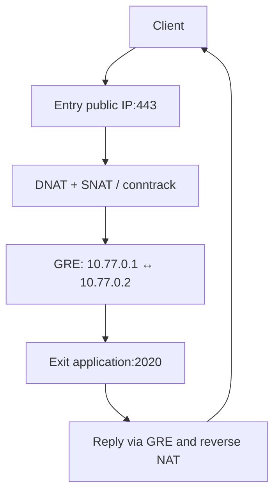

# GreFlow

**GRE tunnels and TCP/UDP port forwarding, with a small Go CLI.**

[](https://github.com/TIR3D4/GreFlow/actions/workflows/ci.yml)
[راهنمای فارسی](docs/README.fa.md) · [Operations](docs/operations.md) · [Architecture](docs/architecture.md)

GreFlow v0.1.1 manages one IPv4 GRE link between two Linux servers. The **entry** accepts public client traffic; DNAT sends it to the **exit** GRE address. SNAT gives replies a predictable return path through the entry. Xray, SSH, Docker and other applications are installed and managed separately.

**GRE has no encryption or authentication.** This is not an encrypted VPN. Use application-layer TLS/encryption where needed. GRE is IP protocol **47**, not TCP/UDP port 47; providers and intermediate networks can block it. No bypass guarantee is implied.



## Requirements

- Linux with IPv4 GRE support; root and systemd. Primary CI target: Ubuntu 24.04. Other distributions require validation.
- Directly assigned IPv4 endpoints, a route between them, and GRE allowed in both provider firewalls.
- `iproute2`, `iptables` (legacy or nft compatibility frontend), `procps`, `iputils-ping`, `curl`, CA certificates; optional `conntrack` for per-port connection counts.
- amd64 or arm64 for release binaries. A native nftables backend is reserved for a later release.
- One GreFlow configuration per host. Applications must listen on the exit GRE address or `0.0.0.0`, not just `127.0.0.1`.

## Installation

Install dependencies on Ubuntu/Debian:

```bash
sudo apt-get update
sudo apt-get install -y curl ca-certificates iproute2 iptables procps iputils-ping conntrack
```

Download and inspect the project installer, then run it:

```bash
curl -fL https://raw.githubusercontent.com/TIR3D4/GreFlow/main/install.sh -o install-greflow.sh
sudo bash install-greflow.sh
```

Root shell one-liner:

```bash
bash <(curl -fLsS https://raw.githubusercontent.com/TIR3D4/GreFlow/main/install.sh)
```

The installer downloads this repository's v0.1.1 release binary and verifies SHA256. Checksums detect download corruption; they are not independent release signatures. No third-party installer runs. The release becomes available after all CI checks pass. Installation does not start a tunnel or change firewall settings.

Build from source instead (Go 1.22+):

```bash
git clone https://github.com/TIR3D4/GreFlow.git
cd GreFlow
go test ./...
sudo env CGO_ENABLED=0 go build -trimpath -o /usr/local/bin/greflow ./cmd/greflow
```

## Quick start: both servers

Replace `ENTRY_IPV4` and `EXIT_IPV4` with addresses assigned to your servers. Allow **GRE protocol 47** between those endpoints in provider firewalls. Keep the same private `/30` and MTU on both sides.

Entry / Iran:

```bash
sudo greflow setup --role entry --local ENTRY_IPV4 --remote EXIT_IPV4
sudo greflow add tcp 443 2020
sudo greflow add udp 444 2021
```

Exit / Foreign:

```bash
sudo greflow setup --role exit --local EXIT_IPV4 --remote ENTRY_IPV4
sudo greflow add tcp 2020
sudo greflow add udp 2021
```

Exit `add` permits the destination service through GreFlow's INPUT chain; it does not install NAT. An exit mapping should name its **destination listening port**, as above. Start your destination application on `10.77.0.2:2020` or `0.0.0.0:2020`. Then:

```bash
sudo greflow test
sudo greflow doctor
# Connect a real client to ENTRY_IPV4:443. Only after it works:
sudo greflow verify yes
```

Run `sudo greflow` for the interactive menu and setup wizard. Default interface: `greflow0`; subnet: `10.77.0.0/30`; MTU: `1476`. Set `--mtu` lower when the underlay requires it. GRE TTL is 255.

## Port forwarding

```bash
sudo greflow add tcp 2020           # entry 2020 -> exit 2020
sudo greflow add tcp 8443 2020      # a different public port
sudo greflow add udp 1194
sudo greflow add udp 10000-20000    # identity range, one rule per direction
sudo greflow list
sudo greflow remove tcp 8443
```

Add matching destination ports/ranges on the exit if its INPUT policy blocks them. Multiple TCP and UDP mappings coexist. Overlapping public ranges for the same protocol are rejected. Offset range mapping is rejected; identity ranges preserve the original destination port without creating thousands of rules. Broad ranges expose every application listening in that range; use only the range you need. TCP and UDP may share a public port.

## Persistence and recovery

Setup writes `/etc/greflow/config.json`, `/var/lib/greflow/state.json` and enables `greflow.service`. The service reconstructs GRE, required sysctls and owned firewall rules after reboot. No global `iptables-save` restore or external firewall persistence is required.

```bash
sudo systemctl start greflow.service
sudo systemctl status greflow.service
sudo greflow restart
sudo greflow apply
sudo greflow repair
sudo greflow down
```

`apply`/`repair` rebuild owned chains and remove duplicate tagged hooks. They recreate the GRE interface and reset traffic counters; active connections can be interrupted. `repair` also rewrites/enables the service. `down` stops the data path but leaves the enabled service, so the next boot starts it again; use `systemctl disable --now greflow.service` to stop persistently.

Configuration changes snapshot config/state and the firewall for diagnosis under `/var/lib/greflow/backups/`. On command failure GreFlow attempts to rebuild its previous configuration and restore its own global sysctl writes. Recovery is best-effort, and a rollback failure is reported. Full firewall snapshots are **never replayed**, preserving unrelated rules. See [operations](docs/operations.md) for limitations and manual recovery.

## Health, doctor and stats

| Layer | Evidence |
|---|---|
| H0 | Persistence enabled; systemd state separately displayed |
| H1 | Owned GRE interface UP and configured GRE IPv4 address |
| H2 | Three GRE peer ICMP probes with loss and latency (`test`/`doctor`) |
| H3 | TCP connect to each single destination port from entry; UDP/ranges require an application test |
| H4 | Expected tagged hooks and firewall rules present |
| H5 | Interface byte counters; stats includes per-rule traffic |
| H6 | Explicit user verification, cleared on apply/down |

`status` does not probe reachability. Interface UP, rule existence or byte counters do not establish working client traffic. `test` exits nonzero for failed observed checks; UDP UNKNOWN is not a success claim.

```bash
sudo greflow status
sudo greflow test
sudo greflow doctor
sudo greflow stats
sudo greflow logs
sudo greflow tune
```

`doctor` adds route, MTU, rp_filter, forwarding, firewall frontend, conntrack capacity, listeners and counters. `stats` distinguishes NAT initial-packet counters from FORWARD traffic and uses optional conntrack for per-port entry counts. `tune` inspects RAM, CPU and kernel limits and offers advice **without changing settings**. Automated kernel tuning is deferred; measure saturation before changing capacity/timeouts.

## Firewall ownership and security

- Dedicated `GREFLOW_INPUT`, `GREFLOW_FORWARD`, `GREFLOW_PREROUTING`, `GREFLOW_POSTROUTING`, `GREFLOW_MANGLE` chains; tagged hooks/rules.
- Never flushes built-in chains or replaces unrelated firewall policies.
- Public DNAT restricted to the configured local endpoint; SNAT/forwarding restricted to GRE.
- GRE INPUT allowed only from the configured remote endpoint; this source restriction is not cryptographic authentication.
- Port inputs, IP addresses, interface names, network, role and MTU validated; commands use argv, not a shell.
- Configuration/state/backups/logs are root-only. A process lock serializes changes.
- Uninstall restores global sysctl values only if their current value still matches GreFlow's write. Audit logs and recovery backups remain.

Reserved chain names and interface aliases must not be used by another application. Coexistence with native nftables base chains, firewalld, UFW reloads and Docker firewall reordering requires checking actual traffic; firewall reloads can remove hooks, after which `repair` restores GreFlow's rules. Native nftables chains may still drop traffic even when an iptables rule accepts it.

## Troubleshooting

- **Peer ping fails:** verify reciprocal endpoint IPs, protocol 47, routes and provider policy. `tcpdump -ni any 'ip proto 47'` distinguishes outer packets from inner traffic.
- **Peer works, TCP fails:** check `ss -lntup` on exit, service binding and matching `greflow add` there.
- **Destination TCP works, public client fails:** check entry NAT/FORWARD counters, public service port in provider firewall, and other firewall managers.
- **Small packets work, large requests stall:** lower MTU on both servers; MSS clamp covers TCP, not UDP. Validate path MTU.
- **Local endpoint not assigned:** v0.1 requires direct IPv4 assignment; public NAT-to-private VPS layouts are unsupported.
- **No root/GRE support:** unprivileged containers are unsupported.

## Uninstall

```bash
sudo greflow uninstall
# Noninteractive:
sudo greflow uninstall --yes
```

Removes only the owned link, chains/hooks, configuration/state, service and installed binary. Backups and audit logs are deliberately retained. Existing SSH/Xray/Docker/Nginx installations are not removed.

## Development and roadmap

```bash
go test -race -cover ./...
go vet ./...
shellcheck install.sh uninstall.sh scripts/*.sh tests/*.sh
bash scripts/build.sh
sudo bash tests/integration.sh ./dist/greflow-linux-amd64
```

Integration tests create isolated entry/exit/client network namespaces and test real TCP/UDP forwarding, range preservation, repeated apply, repair, teardown/reapply and cleanup with DROP firewall policies. CI runs them on Ubuntu 24.04 and builds amd64/arm64 release artifacts.

Roadmap: native nftables backend, multi-instance support, crash-resumable transaction journal, signed releases, richer UDP application probes and measured opt-in tuning. Go was chosen over Bash for typed validation, atomic state files, bounded command execution and unit tests; Bash is limited to bootstrap/build/test scripts.

MIT licensed. See [CONTRIBUTING](CONTRIBUTING.md) and [SECURITY](SECURITY.md).
